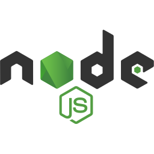
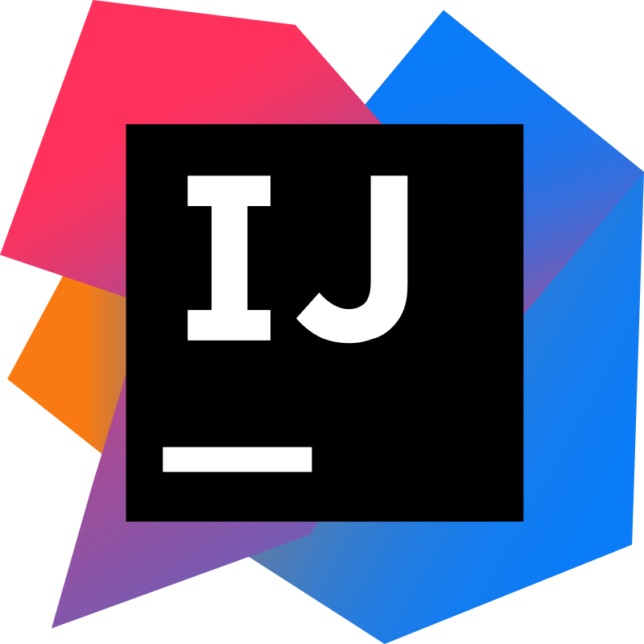

<h1 align="center">
    
</h1>

  
  
  
  

---

<h2 align="center">👋 Introduction</h2>

🏡 Based in Noida, Uttar Pradesh  
💼 Technical Lead at Wipro Limited  
💡 Experienced in designing scalable systems using Java, Spring Boot, and Angular  
📦 Keen on building cloud-native microservices with a strong focus on DevOps and clean architecture

---

<h2 align="center">🚀️ Tech Stack</h2>

### 🌐 Programming Languages

    
    &nbsp;
    
    &nbsp;
    
    &nbsp;
    
    &nbsp;
    

### 🧩 Frameworks & Libraries

    
    &nbsp;
    
    &nbsp;
    
    &nbsp;
    
    &nbsp;
    

### 🧰 Tools, Platforms & Services

    
    &nbsp;
    
    &nbsp;
    
    &nbsp;
    
    &nbsp;
    
    &nbsp;
    
    &nbsp;
    
    &nbsp;
    
    &nbsp;
    
    &nbsp;
    
    &nbsp;
    
    &nbsp;
    
    &nbsp;
    
    &nbsp;
    
    &nbsp;
    
    &nbsp;
    
    &nbsp;
    

---

<h2 align="center">📝 Currently Exploring</h2>

I'm currently in the process of **organizing and writing down my Java knowledge**, topic by topic, through **articles, code samples, and a dedicated GitHub repository**.

While this effort is focused on Java for now, I plan to expand it to include other technologies I’ve worked with over the years.

The goal is to **strengthen my fundamentals**, document insights from real-world experience, and **share what I’ve learned** to support others in their development journey, whether they are just beginning or looking to refine their existing skills.

---

<h2 align="center">💼 Career Journey</h2>

I’m a Java Full Stack Developer with experience across the **finance, insurance, and healthcare domains**, currently working as a **Technical Lead at Wipro**. Prior to this, I contributed to enterprise-level projects at **Capgemini** and **Cognizant**, building scalable backend systems and intuitive frontends.

My core strength lies in backend development using **Java and Spring Boot**, complemented by frontend work with **Angular**. I also have hands-on experience with **legacy enterprise technologies like JSF and PrimeFaces**, having maintained and modernized applications built on these stacks.

I enjoy designing clean architectures, optimizing application performance, and mentoring fellow developers. I’m passionate about writing clean code, applying solid engineering principles, and exploring evolving trends in the **cloud**, **microservices**, and **DevOps**.

---

<h2 align="center">🤝 Connect with Me</h2>

    

---
